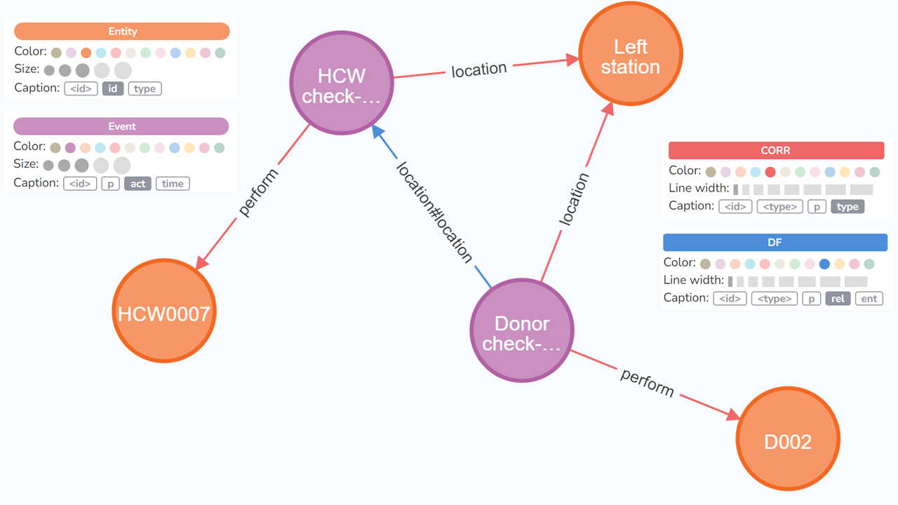
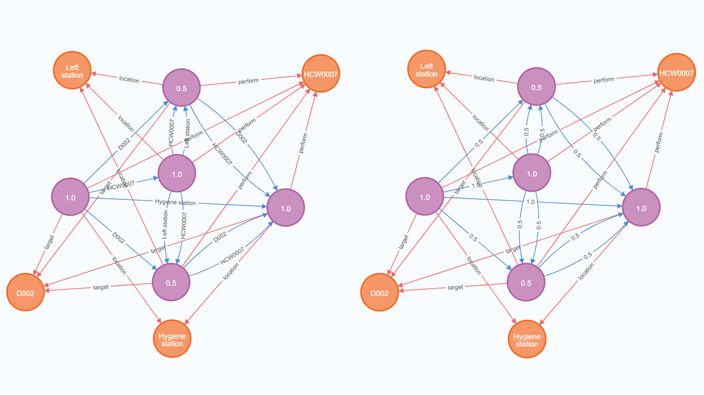
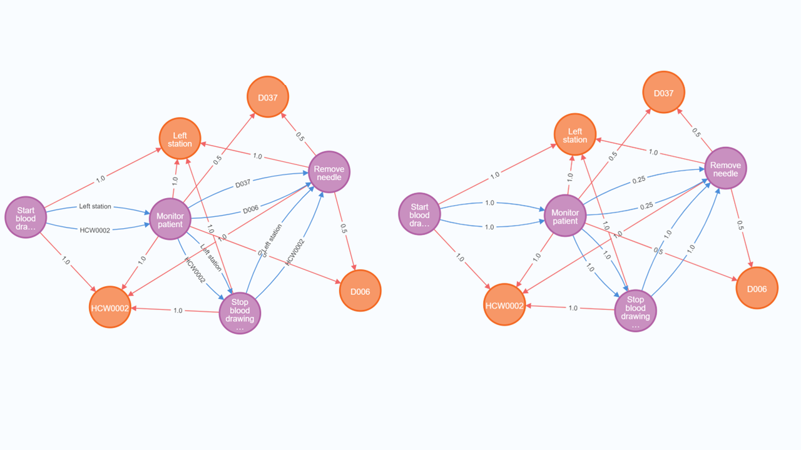
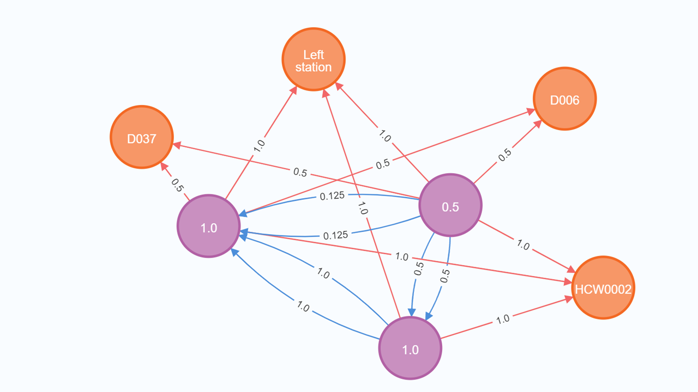

[](https://www.python.org)
[](https://neo4j.com/)


# Enabling Multi-dimensional Analytics of Digital Traces with Ambiguity

This repository contains a prototype implementation of a framework for the construction of an Event Knowledge Graph from a stream of events.

The prototype implementation accompanies the paper "Enabling Multi-dimensional Analytics of Digital Traces with Ambiguity" by Marco Franceschetti, Dominik Manuel Buchegger, Ronny Seiger, and Barbara Weber, submitted to CAiSE2025.

---

## Run

### 1. Prerequisite

The implementation requires Neo4j as the graph database and Python to run the scripts. *In our tests we employed Neo4j 5.24.0 and Python 3.11.10.*

The libraries required to run the program can be installed from the requirements.txt file. They include matplotlib, neo4j, numpy, paho-mqtt, pandas, and validators.


### 2. Edit settings

In **main.py** change lines **20-34**.

- 20-22: Contains the Neo4j connection settings. These need to be changed according to your Neo4j setup.
- 25-31: Contains the MQTT setup and connection settings. Leave ```USE_MQTT=False``` to stream directly from an XES file. Alternatively, you can publish and receive the contents of the file via MQTT (```USE_MQTT="SenderReceiver"```) or only receive MQTT messages if the data is published by another Script (```USE_MQTT="Receiver"```). Change the connection settings according to your MQTT setup.
- 34:    Sets the XES file to stream data from (only set ```xes_file_path=None``` if ```USE_MQTT="Receiver"```).


### 3. Run

Ensure Neo4j is running. Then run **main.py**.

After executing, the ```results``` folder contains a csv file and a graph with the times (in seconds) that Neo4j needed to process each new event in the event stream.

---

## Example

We provide a small sample file under ```logs/extended_event_log_mock.xes```. We show some screenshots of the graph in Neo4j that is constructed from this sample file.

Here we can see an overview of what the Neo4j graph tracks:



Here we can see ambiguous events and the resulting DF (left side: DF labeled with corresponding entity, right side: DF labeled with corresponding probability):



Here we can see ambiguous correlations and the resulting DF (left side: DF labeled with corresponding entity, right side: DF labeled with corresponding probability):



Here we can see ambiguous events & correlations and the resulting DF labeled with probabilities:



